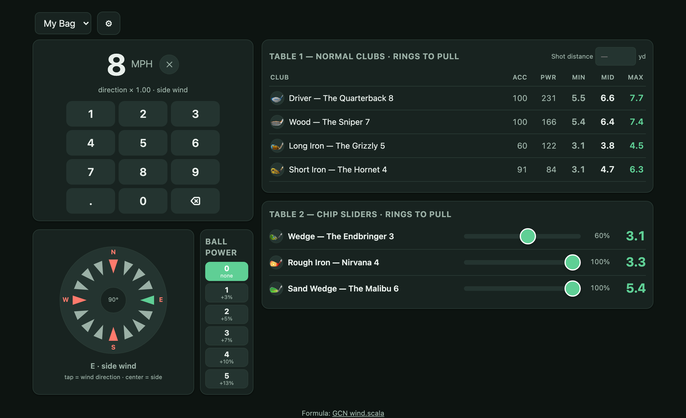
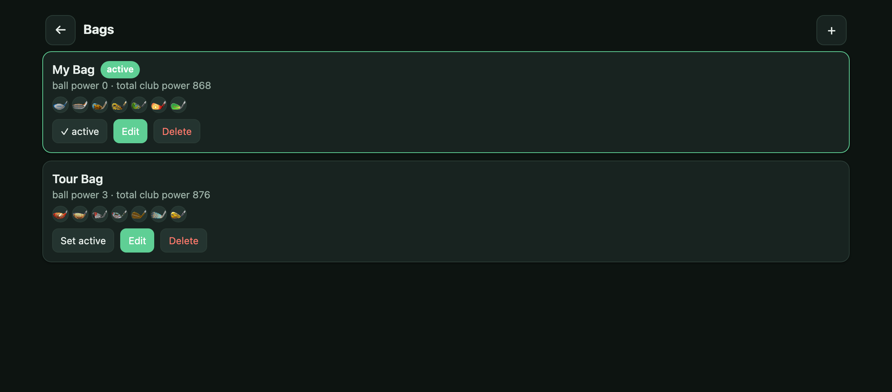
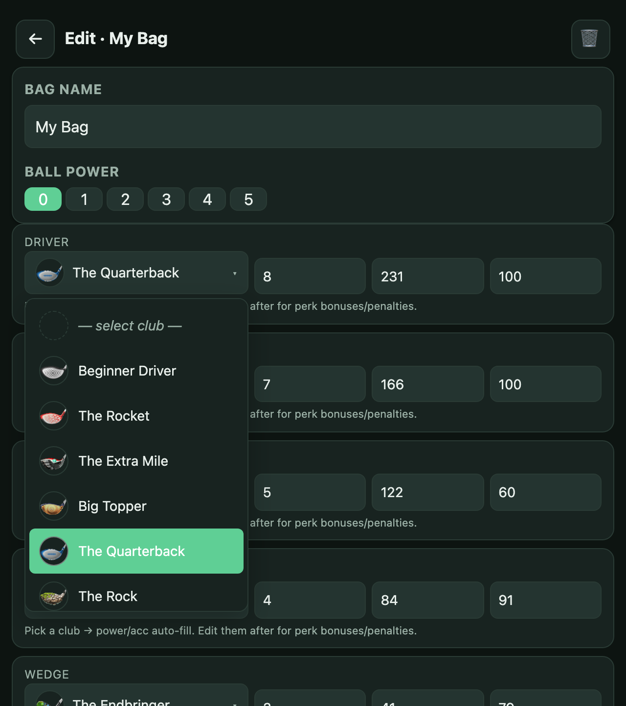
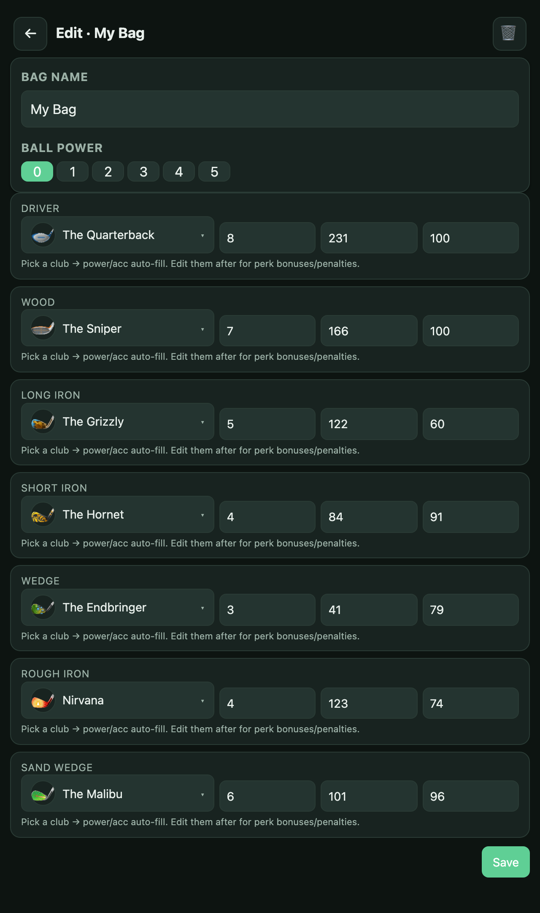
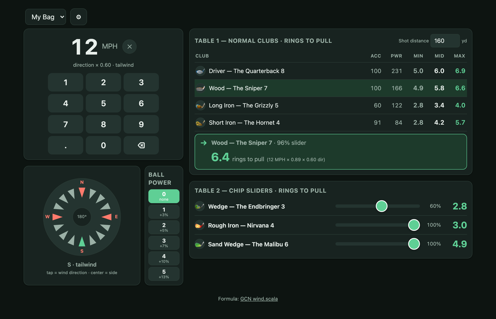
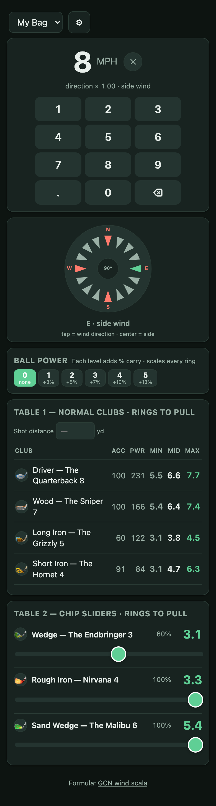

# Golf Clash Wind — rings per MPH

A mobile-first wind calculator for Golf Clash. Tap the wind speed and direction → see exactly how many rings to pull the bullseye, per club, in real time. Works offline once installed.

**Open the app:** <https://silvernine209.github.io/golf-clash-ring-per-mph-generator/>



---

## What it does

- Tap a number on the wind speed pad
- Tap the in-game wind arrow direction on the compass
- Pick your ball power (0–5)
- The table on the right shows **rings to pull** for every club in your bag — live, no math required
- Wedge / Rough / Sand sliders let you read the chip ring count for any distance ≤ club power

The formula is the verified one from Golf Clash Notebook's open-source [wind.scala](https://github.com/golf-clash-notebook/golf-clash-notebook.github.io/blob/dev/modules/site/src/main/scala/golfclash/notebook/wind.scala), including the 1.45× Rough Iron and 1.15× Sand Wedge category multipliers and the 0.9× correction for B52/Grizzly at level ≥ 5. The Python CLI in this repo and the web app both use the same formula.

---

## How to use it

### 1. Open the link on your phone

<https://silvernine209.github.io/golf-clash-ring-per-mph-generator/>

On iPhone Safari: tap **Share** → **Add to Home Screen** and it installs as a full-screen app. Works offline after the first load. Screen stays awake while you're on the Play page.

### 2. Set up your bag

Tap the ⚙ gear in the top-left to open the **Bags** page.



You start with a sample "My Bag". Tap **Edit** to fill it with your actual clubs, or **+** in the top-right to make a new bag from scratch. You can have as many bags as you want (one for tournaments, one for daily, etc.). Each bag stores its own ball power preset.

### 3. Pick your clubs

In the editor, tap each slot's club dropdown:



- The list shows every club Golf Clash has had through 2024, each with its real icon
- Tapping a club **auto-fills power and accuracy** at level 1
- Change the level dropdown → power/accuracy refresh for that level
- The power and accuracy fields are editable — **edit them after picking** to apply any perk bonuses or penalties from your in-game card mods
- Newer clubs not in the list? Pick **"Custom / not in list…"** at the bottom and type any name/power/accuracy



The seven slots are: Driver, Wood, Long Iron, Short Iron, Wedge, Rough Iron, Sand Wedge — same as Golf Clash. Hit **Save** when done.

### 4. Play

Back on the main screen, when you set up a shot in Golf Clash:

1. **Tap the wind speed** on the numpad — e.g. 12 MPH
2. **Tap the compass** in the direction the in-game wind arrow points
   - The 4 cardinal arrows (N/E/S/W) are red to find quickly
   - Center button resets direction to pure side wind
3. **Pick your ball power** if you're using a Power 1–5 ball
4. **Read off the row** for the club you'll hit. The numbers under MIN / MID / MAX tell you how many rings to pull the bullseye into the wind:
   - MAX = full slider (club's max distance)
   - MID = halfway through the club's usable range
   - MIN = where this club first appears (just above the shorter club's max)

### 5. Use Shot distance for the exact answer

If you'd rather not eyeball MIN/MID/MAX, type the in-game shot distance into the **Shot distance** input:



A recommendation card appears below Table 1 with:

- which club to use,
- the suggested slider %,
- the exact rings to pull at *that* specific distance (not just MIN/MID/MAX),
- and the math breakdown so you can sanity-check (`12 MPH × 0.89 × 0.60 dir = 6.4 rings`).

The matching club row is also highlighted in green.

### 6. Chip shots — use the slider

For Wedge / Rough Iron / Sand Wedge shots, drag the slider in **Table 2** to match the slider position you'll use in-game. The live ring count updates as you drag.

---

## Works on phones, tablets, and desktop

The layout adapts. On phone portrait it stacks vertically:



On iPad portrait or a desktop window the wind input and tables sit side-by-side.

---

## The formula (if you're curious)

```
rings_per_mph = actual_carry ÷ ( category_max
                              × (3 − accuracy/50)
                              × category_mult
                              × rule_based_correction )
```

| Term | What it is |
|---|---|
| `actual_carry` | yards the ball needs to travel (= power × slider%) |
| `category_max` | Driver 240, Wood 180, Long Iron 135, Short Iron 90, Wedge 45, Rough Iron 135, Sand Wedge 120 |
| `(3 − accuracy/50)` | base MPH-per-ring at full power and side wind (e.g., 100-acc = 1.0; 60-acc = 1.8) |
| `category_mult` | 1.45 for Rough Iron, 1.15 for Sand Wedge, else 1.0 |
| `rule_based_correction` | 0.9 for B52 / Grizzly at level ≥ 5, else 1.0 |
| ball power coefficient | 1.00 / 1.03 / 1.05 / 1.07 / 1.10 / 1.13 — multiplies `actual_carry` |

Final rings to pull = `rings_per_mph × wind_mph × direction_factor`. Direction factor is 1.0 for pure side wind, 0.6 for pure head/tail, interpolating with `0.6 + 0.4 × |sin(angle)|`.

**Sources:**
- [wind.scala (canonical formula)](https://github.com/golf-clash-notebook/golf-clash-notebook.github.io/blob/dev/modules/site/src/main/scala/golfclash/notebook/wind.scala)
- [Golf Clash Notebook — Wind](https://golfclashnotebook.io/wind/)
- [AllClash Wind Calculator](https://www.allclash.com/golf-clash-wind-calculator-by-allclash/)
- [West Games — using rings](https://west-games.com/golf-clash-how-to-use-the-rings/)

---

## Your data is private

The app is **100% client-side**. There's no server, no account, no analytics. Everything lives in your browser's localStorage. Other people opening the link get their own blank slate; they can't see your bags and you can't see theirs. Clearing your browser data on the `silvernine209.github.io` origin resets the app.

---

## Run it yourself

The whole web app is one `index.html` (plus club icons + a tiny service worker). Anyone can self-host:

```bash
git clone https://github.com/silvernine209/golf-clash-ring-per-mph-generator
cd golf-clash-ring-per-mph-generator
python3 -m http.server 8765
# Open http://localhost:8765
```

GitHub Pages is the simplest free host — enable Pages on a fork's `main` branch and you've got your own copy.

---

## Python CLI (alternative)

If you'd rather generate a static markdown cheat sheet from a YAML config:

```bash
# Edit my_bag.yaml with your clubs
python3 generate.py
# Writes cheatsheet.md
```

Same formula as the web app. Useful for keeping a long-term-versioned record of your bag in git, or piping into other tooling.

---

## Files in this repo

| File / folder | Purpose |
|---|---|
| `index.html` | The web app (single file, no build) |
| `clubs.js` | Embedded catalog: 61 clubs with stats at every level, generated from `clubs.csv` |
| `icons/clubs/*.png` | 64×64 club artwork (MIT-licensed from Golf Clash Notebook) |
| `manifest.webmanifest`, `sw.js` | PWA manifest + offline service worker |
| `my_bag.yaml` | Bag config for the Python CLI |
| `generate.py` | CLI: reads `my_bag.yaml`, writes `cheatsheet.md` |
| `clubs.csv` + `*.yaml` (per category) | Canonical club data |
| `build_clubs_js.py` | Rebuilds `clubs.js` from `clubs.csv` |
| `build_club_icons.py` | Fetches club icons from the GCN repo (idempotent) |
| `build_icons.py` | Generates the PWA app icons |
| `build_screenshots.py` | Regenerates the screenshots in this README |
| `docs/screenshots/` | The PNGs embedded above |

---

## Caveats

- **2018-era club data.** GCN's catalog hasn't been updated since 2018. New clubs released after that aren't in the list — use the "Custom / not in list…" option. Stats for older clubs that have been balance-patched may also have drifted; the per-slot **power / accuracy override** fields handle that.
- **Head/tail wind reduction.** Real Golf Clash reduces head/tail wind's ring effect to ~60% of pure crosswind. The app interpolates: 1.0 at pure side, 0.6 at pure head/tail.
- **Wedge / Rough / Sand are situational.** The Shot-distance recommendation defaults to Wedge for chip-range distances. If you're in rough or sand, adjust the slider on the matching row of Table 2 — same slider % carries over.

---

## Credits

Club artwork, club stats, and the canonical formula come from the open-source [Golf Clash Notebook](https://golfclashnotebook.io/) project (MIT-licensed). The wind calculator UI, mobile-first layout, custom dropdown, and data model in this repo are original.
